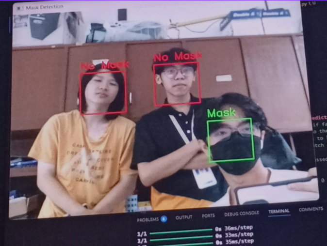

# CNN-Face-Mask-Detection



A complete face mask detection system built using a custom-trained Convolutional Neural Network (CNN) with advanced image preprocessing and real-time inference support.

This project was developed as part of an academic course and demonstrates the full pipeline — from dataset preparation and model training to evaluation and webcam-based deployment.

## Overview?
This project aims to detect whether a person is wearing a face mask or not using image-based classification.

Key characteristics:
- CNN model trained from scratch (binary classification)
- Robust preprocessing to handle varying lighting conditions
- Dataset balancing and augmentation to reduce overfitting
- Real-time inference using MediaPipe face detection


## Setup and Installation 
1. Clone the repository:
```bash
git clone https://github.com/sSODAs/CNN-Face-Mask-Detection.git
cd CNN-Face-Mask-Detection
```

2. Install Dependencies:
```bash
pip install -r requirements.txt
```
Main libraries used:
- TensorFlow / Keras
- OpenCV
- MediaPipe
- NumPy, Matplotlib, scikit-learn

## Running the Project
Train the Model
```bash
python MaskDetection.py
```

Run Real-Time Mask Detection
```bash
python TestModel.py
```
